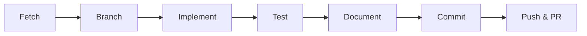
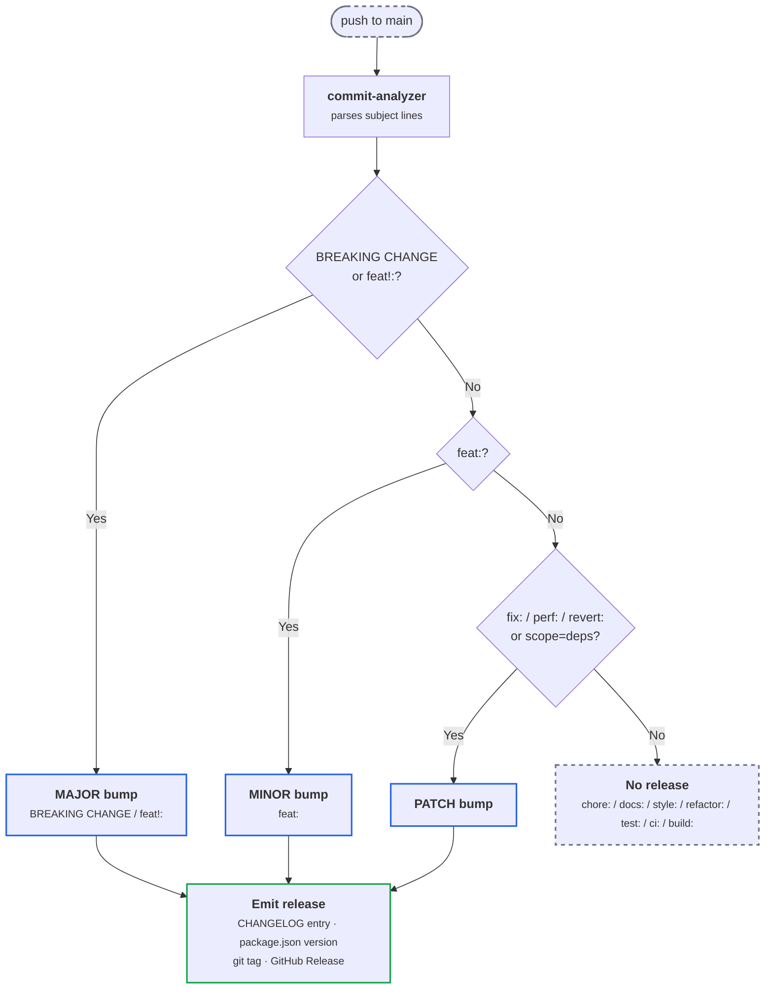

# Contributing

## Development workflow



1. **Fetch**: `git fetch origin` before any work.
2. **Branch**: `feat/<short-description>`, `fix/<short-description>`, `chore/<short-description>`, `refactor/<short-description>`, or `docs/<short-description>`.
3. **Implement**: write code. Mobile-first, accessible, SEO-aware. Follow the conventions in `AGENTS.md`.
4. **Test**: `pnpm preflight` runs every CI job's local equivalent in CI order (secrets -> sast -> deps -> commitlint -> lint -> format-astro -> types -> unit/component -> build -> snapshots -> e2e). Catches issues before pushing. Prerequisites: gitleaks v8.19+ (for secrets), Docker (for sast), Trivy v0.70+ (for deps), `origin/main` fetched - or `origin/$BASE_REF` for stacked PRs (for commitlint), Playwright browsers installed. See README Prerequisites for install paths.
5. **Document**: update `CHANGELOG.md` (semantic-release auto-generates from commits, but a manual entry helps reviewers). Update `AGENTS.md` and `README.md` if the architecture or controls change.
6. **Commit**: [Conventional Commits](https://www.conventionalcommits.org) format, enforced by commitlint via lefthook.
7. **Push & PR**: open a PR against `main`. `ci.yml` runs all 9 jobs on every PR (validation + build + snapshots). `cd.yml` runs on every push to `main` (e2e + accessibility + deploy + release). The two pipelines are independent: `cd.yml` does NOT wait for a CI re-run on the merge to `main`, since the PR's CI run already validated the same code.

## Scripts

See [README.md](README.md) for the full scripts table. The most common:

- `pnpm dev` - local dev server
- `pnpm preflight` - full CI pipeline locally
- `pnpm check` - Biome lint + format with auto-fix
- `pnpm exec playwright test --ui` - Playwright visual debug (no script alias; invoke directly)
- `pnpm ci` - reset local install state (`pnpm clean` + `pnpm install --frozen-lockfile`); the right one-liner when `pnpm install` gets weird

## Commit message format

[Conventional Commits](https://www.conventionalcommits.org/en/v1.0.0/)
validated by commitlint on every commit (via lefthook `commit-msg` hook).

Canonical structure:

```
<type>[optional scope]: <description>

[optional body]

[optional footer(s)]
```

Common types:

| Type | Use for |
|---|---|
| `feat` | A new user-visible feature |
| `fix` | A bug fix |
| `docs` | Documentation only |
| `style` | Formatting / whitespace, no code change |
| `refactor` | Code restructure, no behavior change |
| `perf` | Performance improvement |
| `test` | Adding or updating tests |
| `build` | Build system / dependencies |
| `ci` | CI workflow changes |
| `chore` | Maintenance, scope-free housekeeping |
| `revert` | Reverting a previous commit |

Examples:

```
feat: add smooth coloring method
fix: keep the zoom input in sync after keyboard shortcuts
chore: bump dependencies
docs: update the controls table in README
refactor: extract the number stepper into its own component
test: add e2e smoke for the viewer
build: configure wrangler observability
ci: add release dry-run job
```

**Breaking changes**. Two equivalent forms:

- **Marker**: `!` after the type or scope (`feat!: drop Node 22 support`, `feat(api)!: rename endpoint`). Concise, no description.
- **Footer (canonical per spec)**: `BREAKING CHANGE: <description>` as a footer line:
  ```
  feat: drop Node 22 support

  BREAKING CHANGE: Node 24 LTS is now the minimum.
  ```

Either form bumps the **major** version under semantic-release. The footer form gives reviewers a description of the break in the release notes; the marker form is shorter. Use whichever fits. See the squash-merge caveat under "Merge strategy" for how breaking-change footers behave through GitHub's squash.

Rules:
- Present tense, imperative mood: "add feature" not "added feature".
- Subject under 72 characters.
- Subject starts with a lowercase character (`feat: add` not `feat: Add`).
- Body explains *why*, not just *what*.

References:
- [Conventional Commits 1.0.0 spec](https://www.conventionalcommits.org/en/v1.0.0/)
- [`conventional-changelog` ecosystem](https://github.com/conventional-changelog/conventional-changelog) (home of the `conventionalcommits` preset our `@semantic-release/commit-analyzer` uses)
- [TrigenSoftware `simple-release` GUIDE](https://github.com/TrigenSoftware/simple-release/blob/main/GUIDE.md) (well-written practitioner guide to the spec; alternative tool to ours, but the spec coverage is excellent)

## Why Conventional Commits

Conventional Commits exist to "determine the consumer impact of changes in the codebase" ([semantic-release docs](https://github.com/semantic-release/semantic-release#how-does-it-work)). When commits encode their impact in the message itself, machines decide version bumps, generate release notes, and tag releases without human intervention.

Our release pipeline is intentionally fully automated: every push to `main` with a release-worthy commit ships a tagged release through CI, no manual ritual. Set-and-forget is the goal; verify-once at setup time is the cost.

### Which commit types appear in CHANGELOG

The `conventionalcommits` preset deliberately surfaces only changes consumers care about and hides internal noise. Defaults:

| Type | CHANGELOG section | Visible? |
|---|---|---|
| `feat` | Features | ✅ |
| `fix` | Bug Fixes | ✅ |
| `perf` | Performance Improvements | ✅ |
| `revert` | Reverts | ✅ |
| `docs` | Documentation | ✅ |
| `style` | (hidden) | ❌ |
| `refactor` | (hidden) | ❌ |
| `test` | (hidden) | ❌ |
| `chore` | (hidden) | ❌ |
| `ci` | (hidden) | ❌ |
| `build` | (hidden) | ❌ |

Hidden commits still land in `main`'s git history and the PR audit trail; they just don't pollute CHANGELOG. CHANGELOGs work because they hide noise, and the bar for "noise" includes most internal refactors / test work / CI tweaks / chores.

**Bundling pattern**: when a doc change documents a feature or fix landed in the same PR, write the commit as `feat:` or `fix:` (not `docs:`). The doc lands inside the same CHANGELOG entry as the code, and reviewers see one item instead of two.

## Pre-commit hooks

lefthook runs in parallel on `pre-commit`:
- **gitleaks**: scans staged diff for credential patterns (priority 1; runs first because secrets are permanent in history once committed)
- **lint**: `biome check --write` on staged files (auto-fixes formatting)
- **prettier-astro**: `prettier --write` on staged `.astro` files (Biome's `.astro` formatter is experimental)
- **typecheck**: `tsc --noEmit`

`commit-msg` runs commitlint to validate the conventional commit format.

CI mirrors every hook so bypasses (`git commit --no-verify`) don't reach `main`: the `commitlint` CI job runs `commitlint --from origin/$BASE_REF --to HEAD` (where `BASE_REF` is the PR's actual base branch) on every commit in a PR, the `secrets` job re-runs gitleaks against full history, the `sast` job runs Semgrep static analysis, and the `lint` / `types` / `tests` jobs each cover their slice of the pre-commit checks. Every CI job has a corresponding `pnpm` script so anything CI runs can be reproduced locally.

If you absolutely need to bypass hooks: `git commit --no-verify -m "emergency"`. Don't do this on shared branches.

## Pull request guidelines

PR template lives at `.github/pull_request_template.md`. Fill it in:

- **What**: explicit details on changes. List lingering TODOs with links.
- **Why**: reasoning, architectural decisions, possible implications.
- **How to test**: step-by-step for reviewers.

PRs over 400 lines lose reviewer attention. Split if possible.

## Merge strategy

Pick the method per situation:

- **Squash** (default, when reasonable) for a PR to `main` that bundles commits into one logical change. Keeps `main` linear and yields one clean changelog entry carrying the `(#N)` PR link (see "Squash semantics" below).
- **Rebase** for a PR to `main` whose individual (scoped) commits each deserve their own changelog entry. Replays them onto `main` with no merge commit and no duplicate. Trade-off: the entries do not carry the `(#N)` PR link (only squash's PR-title subject does), and the `[skip ci]` / breaking-change notes below are squash-specific.
- **Merge commit** for a stacked PR onto a feature base (not `main`), to preserve the individual commits in the parent PR's history. Do NOT merge-commit into `main`: this repo stamps the merge commit with the PR title, so it is itself a conventional commit and `semantic-release` counts it on top of the branch commits, producing duplicate changelog entries.

### Squash semantics under semantic-release

Squash is the default for PRs that bundle multiple commits. Beyond keeping `main` linear, squash preserves PR-number references in changelog entries: GitHub auto-appends `(#42)` to the squash subject, which `@semantic-release/release-notes-generator` picks up. Non-squash merges lose this; original commit subjects don't carry PR numbers, so changelog entries can't link back to the PR that landed them. Rationale per [`commit-and-tag-version` FAQ](https://github.com/absolute-version/commit-and-tag-version#should-i-always-squash-commits-when-merging-prs).

GitHub's squash uses the **PR title as the commit subject** and the original
commit subjects as a bulleted body. `@semantic-release/commit-analyzer`
parses the **subject only**; the body's bullets are ignored when deciding
the version bump.

Implications:

1. **PR title is the conventional commit.** Set it to the highest-impact
   type in the PR. If a PR includes both `feat:` and `fix:` commits, the
   PR title should be `feat:` - the fix is implicitly bundled into the
   minor release. The CI `pr-title` job pipes the title into commitlint
   against the same `.commitlintrc.mjs` config that validates per-commit
   messages, so a bad title surfaces as a failing status check (and blocks
   merge when branch protection is enabled).
2. **Verify GitHub's repo setting.** Settings → General → Pull Requests →
   "Default to PR title for squash merge commits" must be enabled.
   Otherwise editors can override the squash message at merge time and
   bypass the validator.
3. **Breaking changes need manual editing.** If an original commit had a
   `BREAKING CHANGE:` footer, that footer is **lost** under squash. Either:
   - Use `feat!:` / `fix!:` in the PR title (the `!` is preserved as the
     subject's breaking-change marker), or
   - Manually edit the squash body at merge time to add a
     `BREAKING CHANGE: <description>` footer before clicking "Confirm
     squash and merge".

## Branch protection

Recommended for shared repos:
- Require all 9 ci.yml status checks to pass before merge (`pr-title`, `commitlint`, `secrets`, `sast`, `deps`, `lint`, `types`, `tests`, `build`).
- Require at least one review (when team grows beyond solo).
- Restrict who can push to `main`.

These require GitHub Pro for private repos, or are free on public.

## Versioning



semantic-release manages versions automatically based on commit types
(per `.releaserc.json` + the conventionalcommits preset):
- `feat:` → MINOR (1.0.0 → 1.1.0)
- `fix:`, `perf:`, `revert:` → PATCH (1.0.0 → 1.0.1)
- Any type with `deps` scope (e.g. `chore(deps):`, used by Dependabot)
  → PATCH
- `BREAKING CHANGE:` in body or `feat!:` → MAJOR (1.0.0 → 2.0.0)
- All other types (`chore:`, `docs:`, `style:`, `refactor:`, `test:`,
  `ci:`, `build:`) → no release

The release job runs live: every push to `main` after a successful
`deploy` job tags the next version, prepends release notes to
`CHANGELOG.md`, bumps `package.json` version, and creates the GitHub
Release. The auto-generated release commit contains `[skip ci]` so it
does not retrigger the workflow.

`[skip ci]` is a GitHub-defined token that skips ALL workflows on that
push, not just `ci.yml`. The token name is misleading in our setup
(the actual workflow being skipped is `cd.yml`; `ci.yml` is PR-only
and never fires on push to main anyway), but GitHub doesn't accept
arbitrary tokens like `[skip cd]`. Without the skip, the auto-commit
would re-trigger `cd.yml`: deploy -> release commit -> push -> cd.yml
-> deploy -> ... in an infinite loop.

The `deploy` job is wired to a GitHub Environment named `production`
via `environment: production` in the workflow. When the gate is
available (public repo, or private repo on Pro / Team / Enterprise),
adding required reviewers in repo Settings activates a manual approval
prompt before each main deploy. On the default setup (private +
GitHub Free + org-owned), the line is inert and deploys run without
pause; the Environment shows up only as a deployment label. The line
stays so the gate is one UI config away on a plan or visibility
change.

## Dependency policy

Versions follow a narrow exact-pin policy:

- **Exact-pinned** (`X.Y.Z`, no range prefix): tools that produce diffs
  on every run if their behavior shifts. Currently `@biomejs/biome`,
  `prettier`, `prettier-plugin-astro`. Install with
  `pnpm add -D --save-exact <pkg>`.
- **Caret-ranged** (`^X.Y.Z`): everything else. The lockfile pins exact
  resolutions; CI uses `pnpm install --frozen-lockfile` so reproducibility
  is guaranteed by the lockfile, not by the range syntax. Caret ranges +
  Dependabot weekly grouped minor/patch updates (5-day cooldown) give a
  controlled upgrade flow without churn.

The `packageManager` field in `package.json` is the single source of
truth for the pnpm version. CI's `pnpm/action-setup` reads it; do not
duplicate the version into workflow `with:` blocks. Dependabot updates
the field (and its sha512 hash) automatically on pnpm bumps.

There is no separate "package.json validation" step. Biome's `check:ci`
validates JSON syntax, `tsc --noEmit` catches field misuse implicitly
via dependency types, and `pnpm run check:deps` (Trivy) catches vulnerable versions.
Skip third-party validators (`publint` etc.) unless the project starts
publishing to npm.

## Adding components

Use the shadcn CLI for primitives:

```bash
pnpm dlx shadcn@latest add tooltip select navigation-menu
```

Drops files into `src/components/elements/`, installs Base UI peer deps (`@base-ui/react`).

For block components and layout primitives, follow the patterns in
existing files.

## Adding pages

```bash
# Static pages
src/pages/about.astro
src/pages/work/[slug].astro

# SSR pages (opt-in per route)
src/pages/api/example.ts
src/pages/dashboard.astro  # add `export const prerender = false`
```

Routes are read from `tests/fixtures/site-pages.ts` (single source of
truth). Add the new route there and the smoke + sync tests in
`tests/e2e/` and `tests/build/` pick it up automatically. API
endpoints follow the same pattern via `tests/fixtures/api-endpoints.ts`.
After adding a route, run `pnpm test:build -u` to regenerate the head-meta
snapshots.
